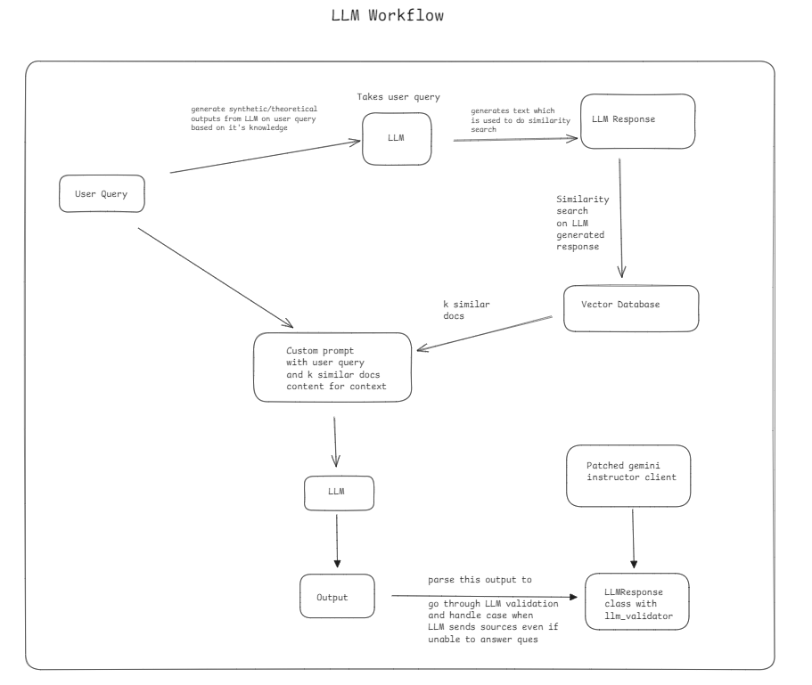

- This repo explains how to implement **HyDe** while creating RAG applications using Langchain with Gemini. 
- We also go a step ahead and use **pydantic** and **instructor** to create **structured LLM outputs**
- `llm_validator` is implemented to validate LLM outputs based on custom queries and error handling done so responses are validated before sending them to the user.
- The repo makes sure code is in proper format and final outputs are ready to be passed as responses to other applicatons/microservices.

***

### HyDe Approach

It is a technique that enhances the retrieval process by generating hypothetical documents. These hypothetical documents are designed to represent potential answers or relevant information that might be contained in the knowledge base.

***
The jupyter notebook implements The HyDe research paper - https://arxiv.org/pdf/2212.10496

Here we don't use `HypotheticalDocumentEmbedder` and rather implement our own `getWebResponseLLM` method so we can implement creating hypothetical documents by our own prompts and not simply use langchain methods.

As per the beliow image, **we send user query to LLM to generate a response and then do similarity search on vector DB on that response to get k similar documents.** 

This generating hypothetical documents is the HyDe where we make the search better by doing simialrity search from the LLM answer from it's own knowledge(in code referred to as `getWebResponseLLM`) and NOT from the user question.

The vector database has data from my personal notes from kubernetes and the code is compatible with any vector database you create. 

Note - **Creating your vector database will be important to run this code.**

Refer to the workflow of notebook as below - 

Consider this repo as learning source of - 
1. how to implement HyDe approach using Gemini
2. How to validate LLM outputs using pydantic and instructor library and return production ready responses